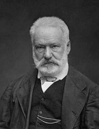

# Hugo



## WARNING - Work in progress.

### Summary

Horace is a suite of Matlab programs for the visualisation and analysis of large datasets from time-of-flight neutron inelastic scattering spectrometers.

The details on what Horace is and how to use it can be found on its wiki pages at http://horace.isis.rl.ac.uk/Main_Page

This a Python interface to Horace using a compiled Matlab library which does not require a Matlab license.

### Limitations

- The interface is extremely clunky
- Graphics don't work
- Documenation is minimal

## Install

Clone this repository (including the `Horace` and `Herbert` submodules).
Install the [Matlab Compiler Runtime](https://www.mathworks.com/products/compiler/matlab-runtime.html).
Change to the `pyHorace` folder or add it to your `PYTHONPATH`.
Run something like:

```python
import horace
from matlab import double as md

m = horace.initialize()
m.call('pyhorace_init')

proj = m.call('projaxes', [md([-0.5, 1, 0]), md([0, 0, 1]), 'type', 'rrr'])
w1 = m.call('cut_sqw', ['/home/vqq25957/sqw_files/spinw/ei30_10K.sqw', proj, md([0.1, 0.02, 0.5]), md([1.5, 2.5]), md([0.4, 0.5]), md([3, 0.5, 20])])
w2 = m.call2('cut_sqw', w1, [md([0.1, 0.5]), md([3, 0.5, 20])])

```

If you have Matlab with a the `mcc` compiler toolbox installed, you can run the `compile_python.m` script to recompile the library.

## Pull requests are welcome!  
